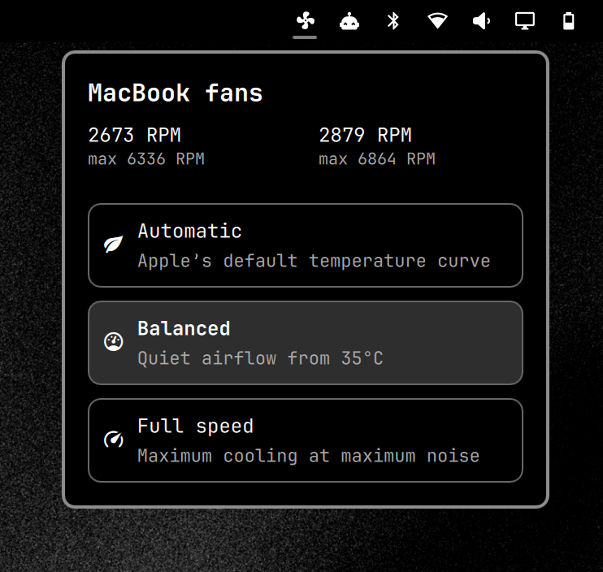

# MacBook Fans for Omarchy



An Omarchy bar widget for controlling `t2fanrd` on Intel MacBooks with Apple's T2 chip. It displays both fan RPMs and offers three profiles:

- **Automatic** — 55–75°C linear curve.
- **Balanced** — quiet, proactive cooling with a 35–75°C linear curve.
- **Full speed** — both fans at maximum speed.

## Requirements

- Omarchy with its shell running.
- An Intel T2 MacBook with one or more Apple SMC fans.
- `t2fanrd` installed and enabled (`systemctl status t2fanrd`).

This does not support pre-T2 Intel Macs or Apple Silicon Macs. It detects the Apple SMC fan files at runtime and writes the matching `FanN` entries in `/etc/t2fand.conf`.

## Install

```bash
omarchy plugin add https://github.com/benekuehn/omarchy.mac-fans.git --enable
sudo ~/.config/omarchy/plugins/benekuehn.macbook-fans/setup-system
```

Choose the right bar section when prompted. The one-time setup installs a root-owned helper and a narrowly scoped Polkit rule; profile changes thereafter need no password. They write the fixed profile to `/etc/t2fand.conf` and restart `t2fanrd`.

## Security

Omarchy plugins run inside the long-lived shell process. Review a plugin before installing it. The installed Polkit rule grants passwordless access only to the root-owned helper, which accepts the three fixed fan profiles above.

## Update or remove

```bash
omarchy plugin update benekuehn.macbook-fans
sudo ~/.config/omarchy/plugins/benekuehn.macbook-fans/setup-system
sudo ~/.config/omarchy/plugins/benekuehn.macbook-fans/teardown-system
omarchy plugin remove benekuehn.macbook-fans
```

## Development

```bash
omarchy plugin validate .
bash -n fan-profile setup-system teardown-system system/omarchy-macbook-fans-profile
```
